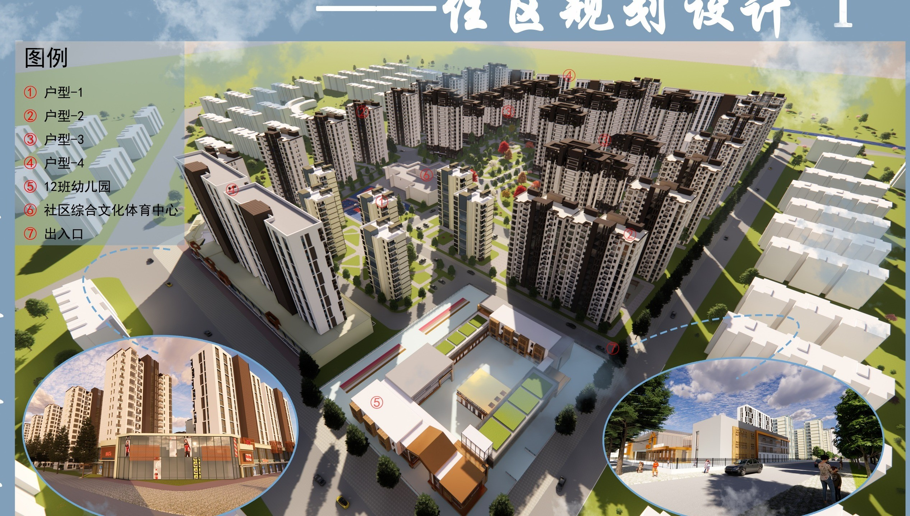
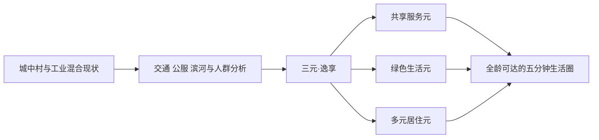
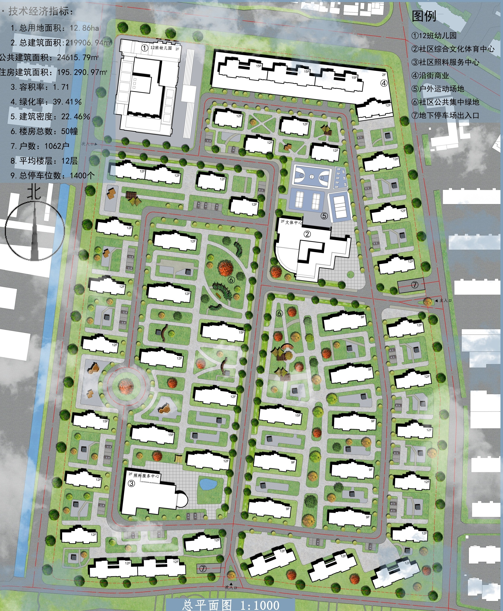
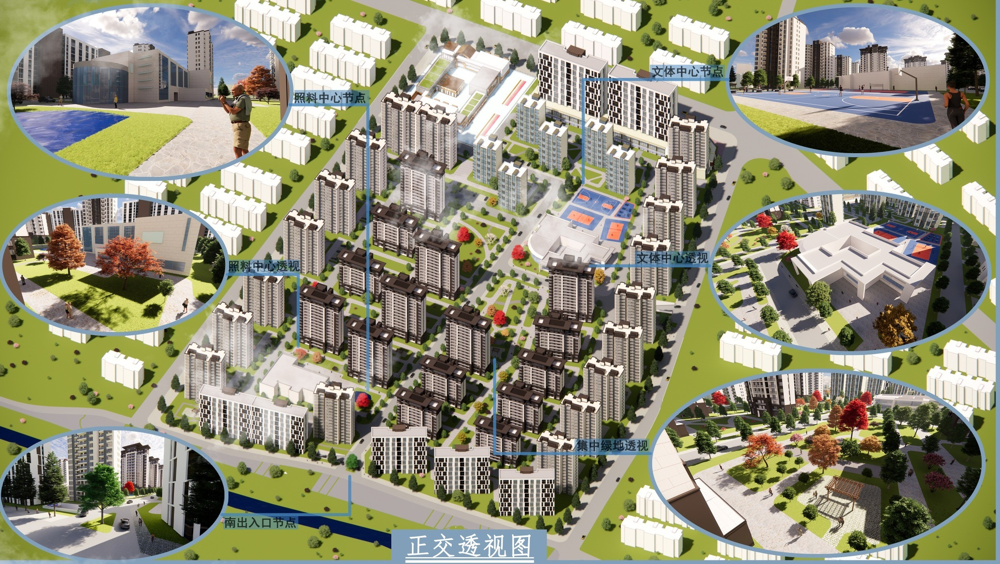
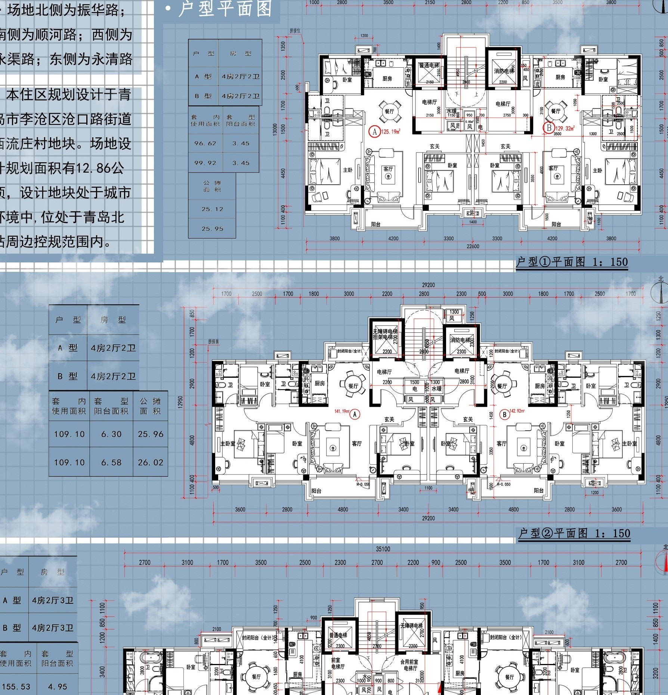
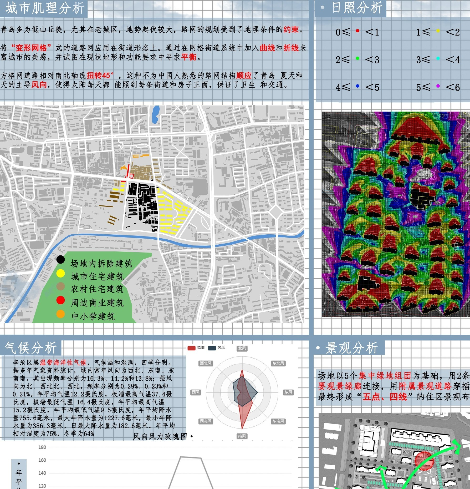

# 三元·逸享｜李沧区西流庄地块住区规划设计

> **Ternary Community｜全龄共享、绿心串联、多元居住**  
> 青岛理工大学城乡规划专业《城乡规划设计 I》课程成果



本项目位于青岛市李沧区沧口街道西流庄地块。设计从城中村更新、原居民生活改善和五分钟生活圈补全出发，在 12.86 ha 场地内统筹住宅、公服、交通、绿地与滨河方向，形成以集中绿心为核心、住宅组团为主体、全龄服务为支撑的完整社区。

“三元·逸享”中的“三元”对应共享服务、绿色生活和多元居住三个相互嵌合的空间系统；“逸享”强调日常生活的便捷、舒适与共享。方案通过 12 班幼儿园、社区综合文化体育中心、社区照料服务中心、沿街商业、户外运动场和多层次开放空间，回应儿童、青年家庭、原居民与老年人等不同群体的使用需求。

## 在线展示

- [GitHub Pages 作品集首页](https://patrick-loylee.github.io/ternary-community-qingdao/)
- [A3 横版完整成果册](docs/a3-residential-planning-portfolio.pdf)
- [GitHub Pages 配置与上传说明](GITHUB_PAGES_SETUP.md)

## 项目概况

| 项目要素 | 内容 |
| --- | --- |
| 项目类型 | 城市住区规划设计 / 城中村更新 |
| 项目位置 | 青岛市李沧区沧口街道西流庄地块 |
| 场地范围 | 振华路以南、顺河路以北、永清路以西、永渠路以东 |
| 总用地面积 | 12.86 ha |
| 总建筑面积 | 219,906.94 ㎡ |
| 住宅建筑面积 | 195,290.97 ㎡ |
| 公共建筑面积 | 24,615.79 ㎡ |
| 容积率 | 1.71 |
| 建筑密度 | 22.46% |
| 绿地率 | 39.41% |
| 规划户数 | 1,062 户 |
| 建筑总数 | 50 幢 |
| 机动车停车位 | 1,400 个 |

## 设计主线



### 共享服务元

北侧 12 班幼儿园、中部社区综合文化体育中心、室外运动场、南侧社区照料服务中心与沿街商业共同构成社区公共服务网络。设施沿主要步行路径布置，使教育、照料、文化、运动与日常消费能够被连续到达。

### 绿色生活元

集中绿心是社区内部的公共空间核心，多个宅间花园向住宅组团渗透，并与南侧滨河方向建立景观联系。环形步道、林下休憩、儿童游戏、运动场和邻里活动共同构成全龄共享的开放空间。

### 多元居住元

方案通过不同层数、围合方式和户型面积形成多样住宅组团。约 90-110 ㎡的紧凑与主力户型，以及约 125-180 ㎡的改善户型，共同回应原居民安置、青年家庭成长、多代共居和改善型需求。

## 场地研究与规划回应

项目基地北高南低，高差约 4.77 m。北侧振华路承担主要城市交通与公交联系，东北方向公共服务和零售较集中；南侧大村河具备景观潜力，同时存在防洪、蓝线和生态治理要求。调研归纳出以下主要问题：

- 场地内部道路缺少等级，停车侵占步行空间，并存在消防通行隐患。
- 周边教育、购物和社区公共服务不够完整。
- 原有住宅类型、建筑界面和景观空间较为单一。
- 滨河资源利用率较低，缺少连续开放空间和公共活动。

规划据此将主要人行到达与北侧公共交通联系，主要车行从东侧永清路进入，南侧设置面向滨河方向的慢行入口；停车以地下为主，内部道路、宅间步行和绿地系统分层组织。

## 总体规划



总体结构由集中绿心、住宅组团、公共服务节点和分级交通共同构成：

- 集中绿心位于社区核心，并通过支线绿地进入各住宅组团。
- 12 班幼儿园位于北侧相对独立地块，便于接送并减少穿越社区内部。
- 社区综合文化体育中心与户外运动场位于中部，共同形成主要公共活动节点。
- 社区照料服务中心布置于南部，服务老年居民并联系安静的宅间绿地。
- 沿街商业和社区出入口共同塑造开放、连续的城市界面。
- 地下停车出入口沿外围组织，减少机动车对中心公共空间的切割。

## 社区生活与公共空间



公共空间从中心绿心向宅间花园、入口广场和沿街界面逐级展开。社区内部不仅提供观看性的景观，还承载运动、儿童游戏、文化活动、邻里交往和日常休憩。

- 中心绿心：主景观轴、环形步道、林下空间与多层植物共同形成社区客厅。
- 文体共享：文化体育中心与球场相邻，适应全天候与不同年龄段活动。
- 邻里花园：分散服务各住宅组团，形成短距离、高频率的日常开放空间。
- 滨河联系：南侧慢行入口与绿地朝向大村河延伸，建立社区与自然环境的联系。

## 住宅类型与技术校核



户型以南向采光、自然通风和合理交通核为基础，并通过面积梯度回应不同家庭结构。竖向设计顺应北高南低地势，结合道路控制标高、建筑室内外标高与排水方向，保证主要步行路径连续可达。



方案通过日照、气候、景观与规划结构分析校核建筑布局和居住环境：

- 冬季日照分析用于校核住宅间距和公共空间采光。
- 青岛季风与降水特征用于指导朝向、通风、排水和绿地渗透。
- 景观分析验证集中绿地与宅间绿地之间的连接关系。
- 规划结构分析校核道路、公共服务、绿地与建筑组团的协同关系。

## 完整 A1 展板

| 展板 | 内容 | 文件 |
| --- | --- | --- |
| I | 区位、用地、交通与场地现状 | [查看高清图](assets/a1-board-01.jpg) |
| II | 总平面、设计理念、人口与路网推演 | [查看高清图](assets/a1-board-02.jpg) |
| III | 竖向设计与四类住宅户型 | [查看高清图](assets/a1-board-03.jpg) |
| IV | 沿街立面、社区鸟瞰、日照与环境分析 | [查看高清图](assets/a1-board-04.jpg) |

## 仓库结构

```text
github-showcase/
├─ index.html                                  GitHub Pages 作品集首页
├─ README.md                                   仓库介绍与项目叙事
├─ GITHUB_PAGES_SETUP.md                       仓库创建、上传与 Pages 配置说明
├─ LICENSE.md                                  作品版权和使用范围声明
├─ .gitignore                                  排除大型源文件与本地临时文件
├─ .gitattributes                              PDF 二进制文件规则
├─ .nojekyll                                   保持静态文件原样发布
├─ assets/
│  ├─ hero-community.jpg                       社区整体鸟瞰
│  ├─ masterplan.jpg                           住区总平面
│  ├─ community-life.jpg                       中心绿地与社区生活
│  ├─ housing-types.jpg                        住宅户型
│  ├─ climate-analysis.jpg                     环境分析
│  └─ a1-board-01.jpg ... 04.jpg                四张完整 A1 展板
└─ docs/
   └─ a3-residential-planning-portfolio.pdf    16 页 A3 横版最终成果册
```

## 版权说明

本仓库用于个人学术作品集展示。项目图纸、图像、文字和展示材料仅供学习与作品评阅，未经作者书面许可，不得复制、再发布、修改、用于模型训练或用于商业用途。详见 [LICENSE.md](LICENSE.md)。
